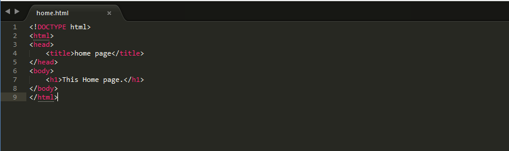

<h4>What is an URL Module ?</h4>
<p>This module consists of  library of functions to parse the urls.</p>
<p>functions of this module contains the url object which contain the properties which hold different parts of the url.</p>
<h4>The Built-in URL Module</h4>
	<ul>
		<li>url module splits the web address into different readable parts.</li>
		<li><b>require()</b> is used for including url module.</li>
	</ul>
<h4>Syntax</h4>

```javascript
var url = require('url');
```

<table class="pc-table">
	<tr>
		<th>Method</th>
		<th>Description</th>
	</tr>
	<tr>
		<td>url.parse()</td>
		<td>This methods returns URL object.</td>
	</tr>
	<tr>
		<td>url.resolve()</td>
		<td>This methods resolves URL.</td>
	</tr>
	<tr>
		<td>url.format()</td>
		<td>This methods returns a formatted URL string</td>
	</tr>
</table>
<h4>Example: Splitting URL into defferent parts.</h4>

```javascript
var url = require('url');
var webAddress = 'http://localhost:9090/home.html?id=1234&name=pc';
var q = url.parse(webAddress, true);

console.log(q.host); //returns 'localhost:9090'
console.log(q.pathname); //returns '/home.html'
console.log(q.search); //returns '?id=1234&name=pc'
```

<h4>Example </h4>  
<p>Create two files <b>index.html</b> and <b>home.html</b></p>  
<p><b>index.html</b></p>  


<p><b>home.html</b></p>



```javascript
var http = require('http');
var url = require('url');
var fs = require('fs');

http.createServer(function (req, res) {
var q = url.parse(req.url, true);
var filename = "." + q.pathname;
fs.readFile(filename, function(err, data) {
    if (err) {
	 res.writeHead(404, {'Content-Type': 'text/html'});
	 return res.end("404 Not Found");
	}  
	res.writeHead(200, {'Content-Type': 'text/html'});
	res.write(data);
	return res.end();
	  	});
	}).listen(8080);
```

<p>save above code with file name <b>url.js</b> and start the node server</p>
<h4>Run url.js</h4>

```javascript 
node url.js
```


<h4>Output</h4>


